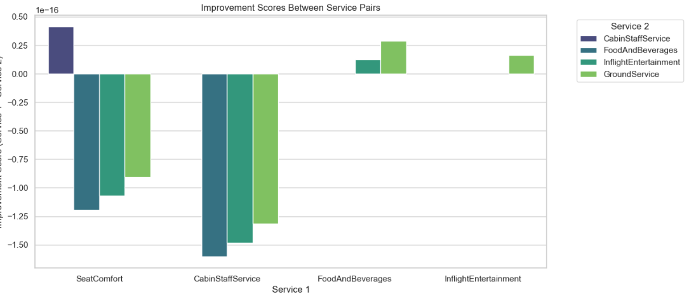

# Forage Job Simulator: A Data Science Project (STILL IN PROGRESS)

This project aims to simulate a forage job, utilizing data science techniques to extract, transform, analyze data, and data model data for decision-making.

## Table of Contents
- [Overview](#overview)
- [Stage 1: Data Engineering](#stage-1-data-engineering) - Complete
- [Stage 2: Data Analytics](#stage-2-data-analytics) - In prog
- [Stage 3: Data Science](#stage-3-data-science) - In prog
- [Technical Requirements](#technical-requirements)
- [Getting Started](#getting-started)

## Overview
This project is designed to explore the forage job Airways data using data science techniques. The data was be extracted from a public website, transformed into a suitable format, and analyzed using various tools and techniques.

## Stage 1: Data Engineering (Done)
### Objective
In the first stage, we'll focus on Extracting, Transforming, and Loading (ETL) forage job data from the www.airlinequality.com/ website using Python's Beautiful Soup library for web scraping.

### Tasks
- Web scraping: Use Python's Beautiful Soup library to extract data from the www.airlinequality.com/ website.
- Data transformation: Transform the data into a tabular format.
- Data loading: Load the transformed data into a Microsoft SQL Server database.
- Data cleaning: Clean and structure the data in the Review table.
- Data normalization: Normalize the Review table.

## Stage 2: Data Analytics - Folder 2. Data Analytics (In progress)
### Objective
In the second stage, we'll use data analytics techniques to gain insights from our data.

### Tasks
- Data visualization: Use Power BI to create visualizations of the data.
- Data analysis: Use Python to explore and analyze the data.

## Stage 3: Data Science - Folder 3. ML Data Model (In progress)
### Objective
Finally, in the third stage, we'll apply machine learning (ML) predictive models and Natural Language Processing (NLP) techniques to analyze the data and make predictions.

### Tasks
- Model development: Develop ML predictive models using Python.
- NLP analysis: Perform NLP analysis to extract insights from text data.

## Technical Requirements
- Python 3.x / Jupiter notebook
- Beautiful Soup library
- Microsoft SQL Server
- Power BI
- Python libraries (pandas, NumPy, and more)

## RESULTS
### DashBoards Power BI:

### ML Predictive Model:
#### Predict Recommend Service using RandomForestClassifier

### Using Hyperparameter Tuning

### Using NN

### Sentiment Analysis

### ML Pattern and Insight Model:
#### Average Service Ratings by Cluster:

### Kmeans Clustering

### Multivariate
#### Kmeans Clustering PCA and SNE

#### DBSCAN Clustering PCA and SNE

#### Hierarchical Clustering PCA and SNE

### Association Rule

### Service Performances
#### Service Pairs

#### Distribution Services

